# Challenge 18: Social Network API with Mongoose

## Description
Social media is a huge part of most people's lives, more so than ever before.  The systems that power the most popular sites have to store and manage an enormous amount of data efficiently. This project explores the technologies that connect users, thoughts, friends, and reactions with each other. The routes for retrieving or changing data can be tested in Insomnia. This project taught me how to use Mongoose to store data in documents, use schemas and virtuals to build models, and connect to an express server using mongoose connection.

## Table of Contents
- [Description](#description)
- [Installation](#installation)
- [Usage](#usage)
- [Credits](#credits)
- [Contributing](#contributing)
- [Tests](#tests)
- [License](#license)
- [Questions](#questions)

## Installation
Open the root directory in the Integrated Terminal:

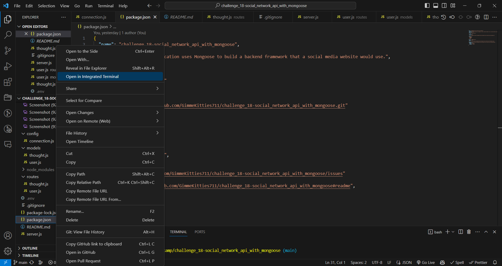

Then run (type and enter) `npm install`

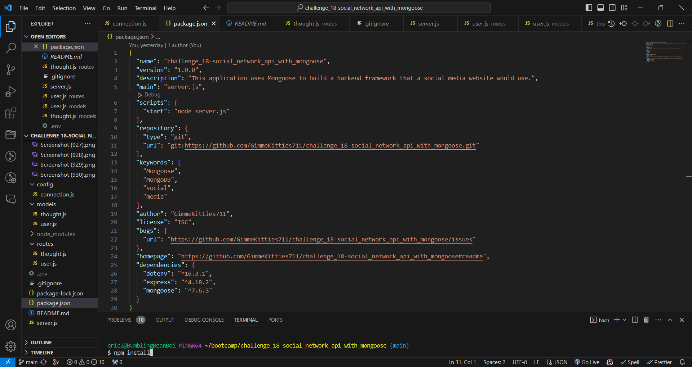

once you do that, the following packages will be installed:

`dotenv @ 16.3.1`
`express @4.18.2`
`mongoose @7.6.3`

## Usage
A walkthrough video that demonstrates the application can be found [here](https://www.youtube.com/watch?v=S-9U2JyAipU&t=221s).

there are some thingies you have to keep in mind as you test the insomnia routes:

Get All Users `http://localhost:3001/api/users`

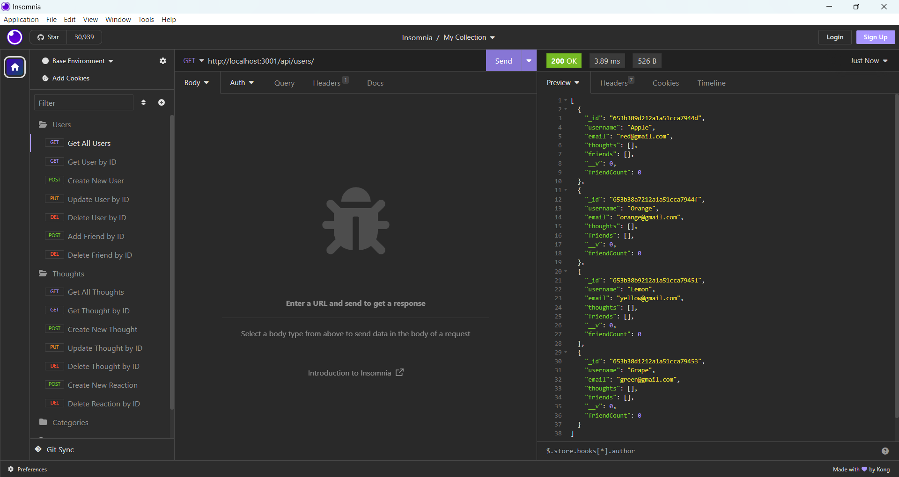

Get User by ID: `http://localhost:3001/api/users/id`
Functions the same as Get All Users without the ID

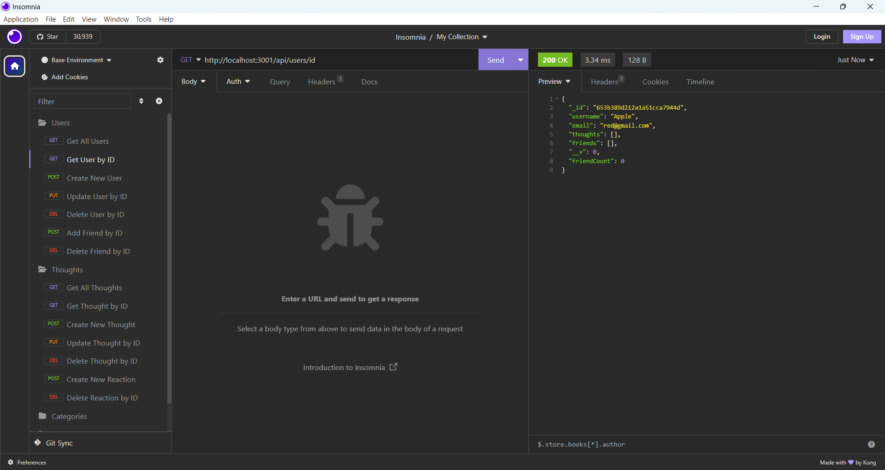

Create New User: `http://localhost:3001/api/users/`

1. Any text that contains a backslash or double quote must be escaped by an additional backslash. See the Usage section of [my Challenge 13 readme](https://github.com/GimmeKitties711/challenge_13-internet_retail_back_end) for details.
2. You are required to enter both a username and an email for your new user to be accepted. Leaving out either field will result in validation errors

Update User by ID: `http://localhost:3001/api/users`
the body of the request, if it is empty or no body, the user will not undergo any changes (api/users/id). However, if you do decide to make changes, you do not have to change both fields. You can choose to change only one of them

You cannot create the exact same user twice (same username and email) if you do it will cause an error.

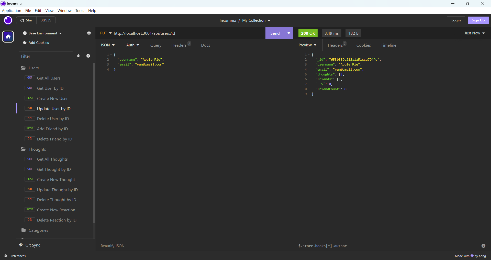

Delete User by ID `http://localhost:3001/api/users/id`

deleting a user by id will cause update and get user by id to fail

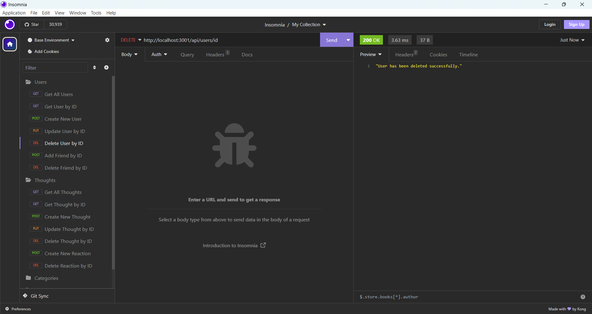

Add Friend by ID `http://localhost:3001/api/usrss/userId/friends/friendId`
the user associated with userId adds the user associated with the friendId. Adding a friend is not mutual. If User 1 adds User 2 to their friends list, that does not automatically mean that User 2 would add User 1 in turn. You are allowed to add friends whose ids don't exist (like changing a few characters in a user's id) as long as the character length is correct; however, it is not recommended to do this as no actual user is tied to the mutilated id and it would causer confusion.

Attempting to delete a user with an ID that does not exist will result in an error.

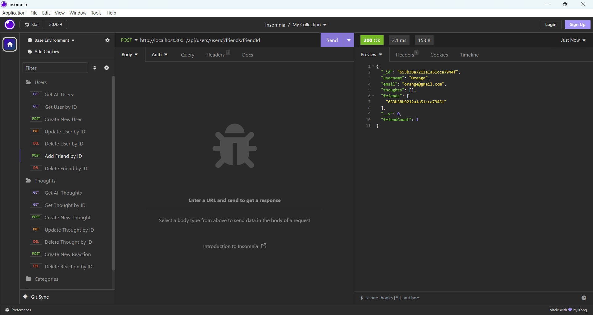

Delete Friend by ID `http://localhost:3001/api/users/userId/friends/friendId`

opposite to Add Friend by ID removes a friends from userId's friends array.

Attempting to delete a friend with an ID that does not exist will not result in an error but it will leave the user's friends array unchanged.

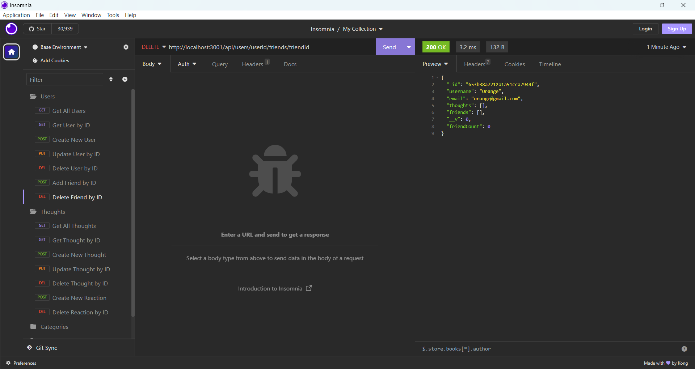

GET ALL THOUGHTS `http://localhost:3001/api/thoughts`

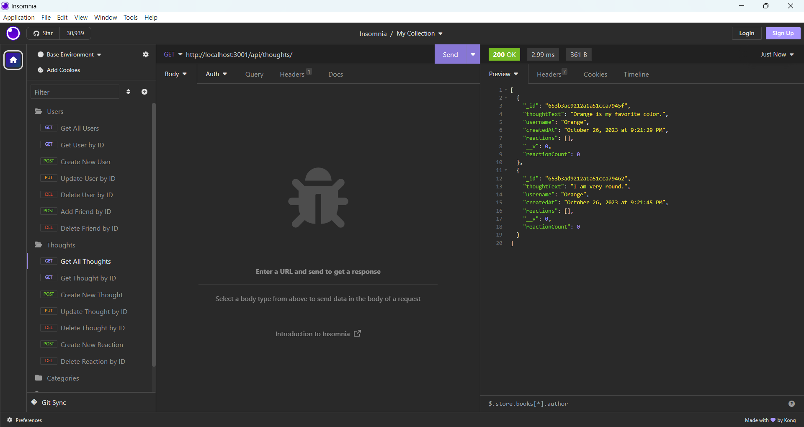

Get Thought by ID `https://localhost:3001/api/thoughts/id`

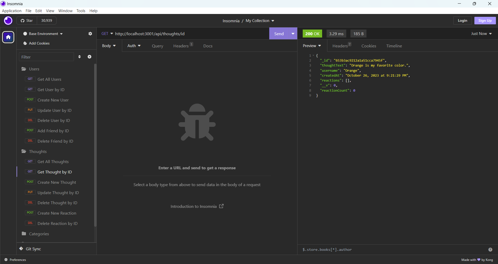

Create New Thought `http://localhost:3001/api/thoughts`

required: { thoughtText, username, userId } thoughtText is required to be between 1 and 280 characters (causes an error if 0 or 281 characters) The username you enter can actually be different from the username attached to the userId because even though you write the thoughts under a different username they are attached to the username associated with the userId. (pictures maybe)? just like posting a new user, if you leave fields out it will cause errors

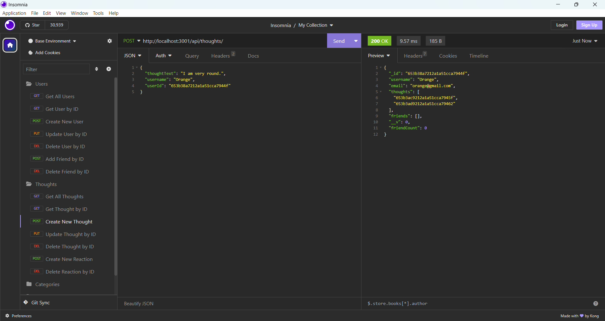

Update thought by ID (maybe don't mention the post thingy and put thingy we did for users?) When you update the thought text you can change two things: (also for the get thought by id thingy) the thoughtText and the username. you are free to change either or both of them, and the thought after the changes will show in the result of a successfully request

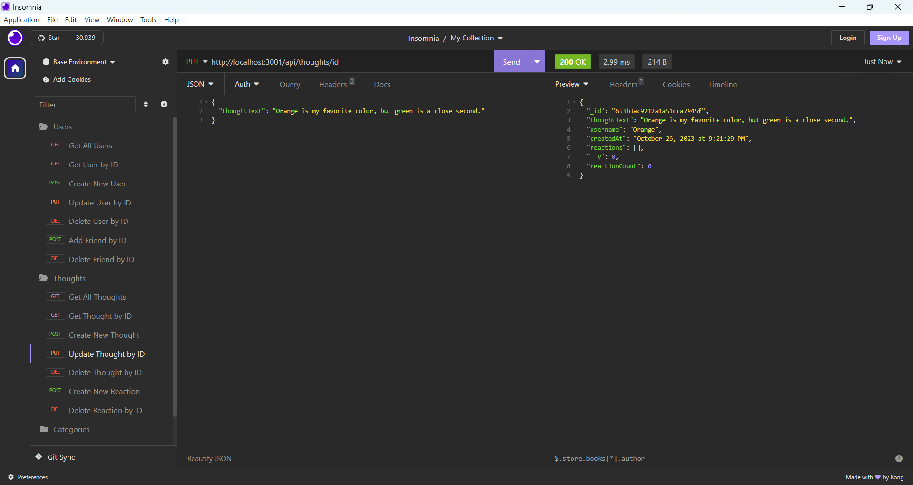

Delete thought by ID: `http://lcoalhost:3001/api/thoughuts/thoughtId`

Attempting to delete a thought with an ID that does not exist will result in an error.

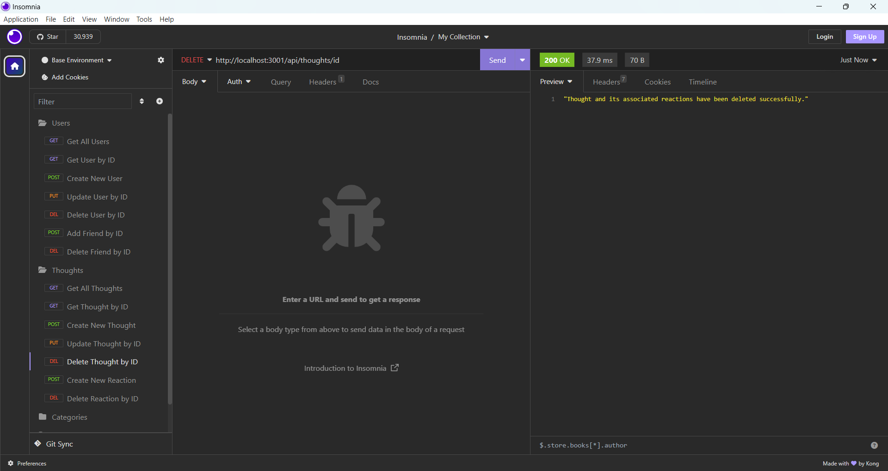

Create New Reaction `http://localhost:3001/thoughts/thoughtId/reactions`

reactionBody has a char limit of 1-280 just like thoughtText, and in addition you are required to enter a username to indicate who made the reaction.

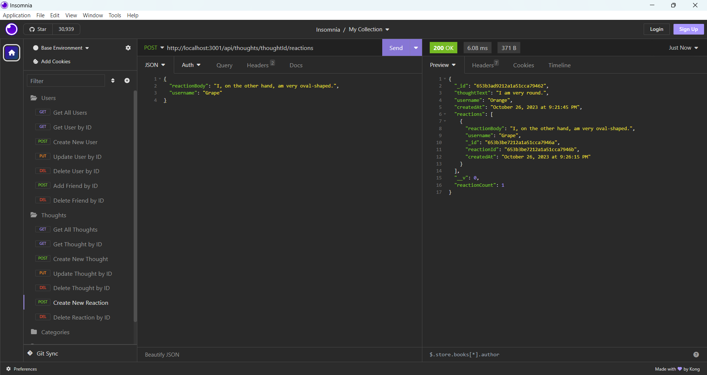

Delete Reaction by ID `http://localhost:3001/thoughts/thoughtId/reactions/reactionId`

unlike create new reaction, delete reaction by id requires both a thoughtId and a reactionId. Basically it will remove the reaction specified by reactionId from the thought associated with thoughtId's reaction array.

If you attempt to delete a reaction by an ID that does not exist, you will not receive an error but the thought's reactions array will remain unchanged.

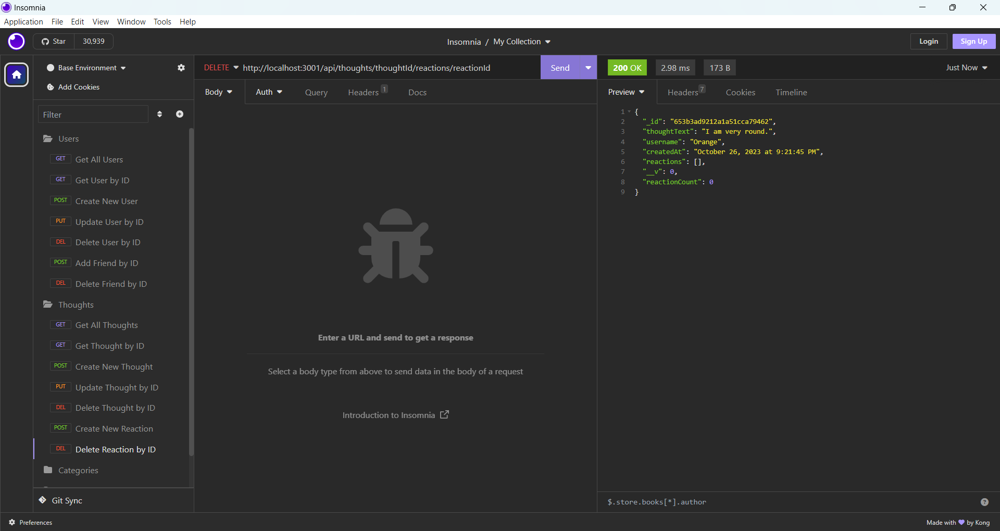

## Credits
I forgot to mention in the last part that if you try to delete a reaction that does not exist the thought's reactions array stays the same but if you try to delete a thought that doesn't exist it throws an error, same for users. Received assistance from instructor Robbert Wijtman insteructor in the *#02-ask-the-class* Slack channel. Also receievd assistance from AskBCS assistants Joem, Zack, and Shaun. The following web resources helped me write the code for this project:

1. [YouTube: MONGOOSE - Setting up Mongoose with Express and creating a Model](https://youtu.be/_ST946yIFSw?si=Lx0DSM51Bi52-NB-)
2. [YouTube: MONGOOSE: Creation and Fetching Data](https://youtu.be/E1w9kthC4YQ?si=UzMJ1r5x3R3ufF2p)
3. [The $in operator](https://www.mongodb.com/docs/manual/reference/operator/query/in/)
4. [YouTube: Mongoose part 2: Update, Delete, and intro to subdocuments](https://www.youtube.com/watch?v=cedhqsQ7FZs)
5. [Regex 101](https://regex101.com/)
6. [How to use virtuals in Mongoose](https://mongoosejs.com/docs/tutorials/virtuals.html)
7. [The toLocaleDateString() method](https://developer.mozilla.org/en-US/docs/Web/JavaScript/Reference/Global_Objects/Date/toLocaleDateString)
8. [The toLocaleTimeString() method](https://developer.mozilla.org/en-US/docs/Web/JavaScript/Reference/Global_Objects/Date/toLocaleTimeString)
9. [How to use getter functions in Mongoose](https://mongoosejs.com/docs/tutorials/getters-setters.html)

## Contributing
If anyone has any ideas on how this project can be improved or expanded on, I would be happy to hear them.

## Tests
No tests have been written for this application.

## License
No license is attached to this repository.

## Questions
If you have any questions for me, you can [follow me on GitHub](https://github.com/GimmeKitties711) or email me at eric20wang.wang@gmail.com.
